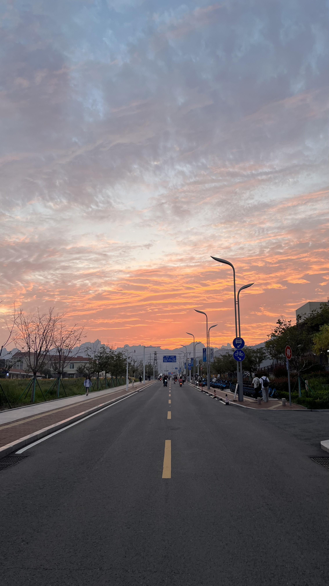
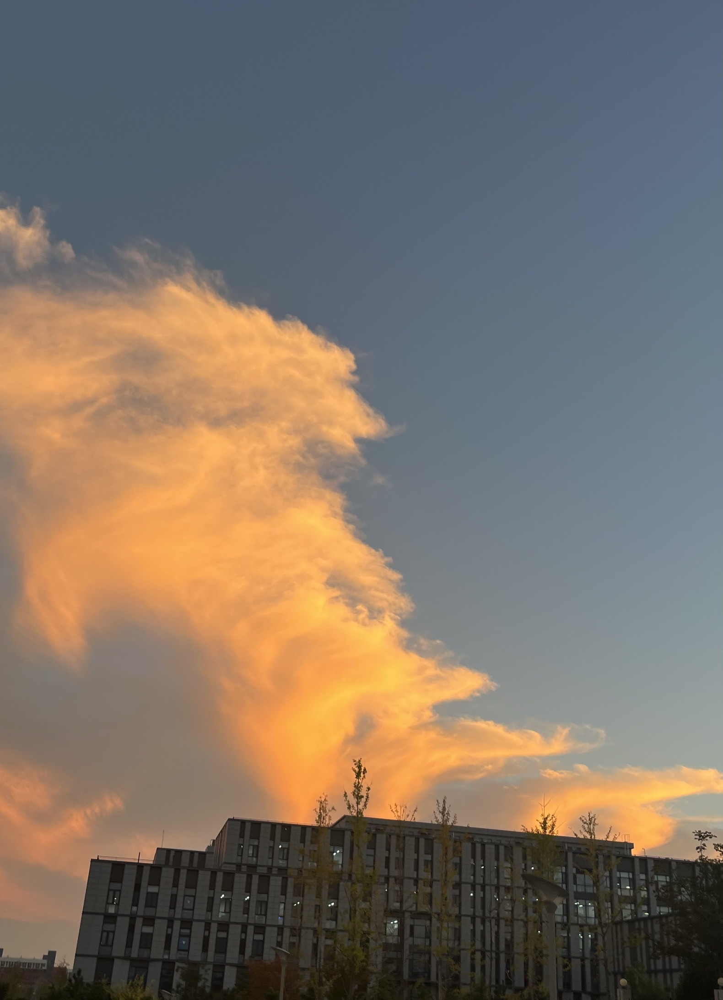

姓名：张心顺  学号：23120014029

| 姓名和学号？         | 张心顺，23120014029                    |
| -------------------- | -------------------------------------- |
| 本实验属于哪门课程？ | 中国海洋大学25秋《软件工程原理与实践》 |
| 实验名称？           | 实验1：热身运动                        |

## 一、实验内容

1. **自我介绍**

   - **介绍我自己**

     我叫张心顺，是2023级计算机科学与技术一班的大三生。我在大一下学期出自对个人兴趣和未来发展的考虑，计划从我感兴趣的经济学转到计算机专业，目前即将实现。

     我的兴趣爱好广泛但无一精通，对政治、历史有浅显的关注，对贝斯有一定的兴趣。偶尔看看书抄抄诗，更多的空闲时间都在社交媒体和打游戏上，但对时间白白花费于此感到郁闷。

     最近值得留意的记忆是云。

     

     连绵的大珠山深刻地影响了云的形状。路上的鲜花还是盛开。临近中秋，傍晚总是给云晕染上喧嚣的颜色。透过橙黄的霞，是驻足留影之人眼中点点的虹。可惜我没能留下眼前最好的景色。

     

   - **介绍家乡，并推荐食堂最好吃的一道菜**

     我的家乡是山东省枣庄市，此地有崇山峻岭，茂林修竹。京杭运河河畔坐落着5A级景区台儿庄古城，有全球最大的石榴园林，有红色景区铁道游击队纪念馆。

     枣庄人常说本地三大美食，辣子鸡，菜煎饼，羊肉汤。

     自己最喜欢食堂的一道菜是听海二楼西北角的蛋炒饭。最好吃可能算不上，但是性价比不错，八元吃饱。

     

   - **介绍自己的成就、成果、技能和专业相关经验经历，并进行自我评估**

     目前我已基本掌握CPP、PYTHON语言的使用，对计算机专业各课程有初步的了解，熟练使用各类大模型，初步了解深度学习。

     我对深度学习、区块链、WEB3有浓厚的兴趣。对量子信息有所关注，对计算机硬件、系统方面有一定的兴趣。

     我认为自己恰恰缺少自己感兴趣的领域的知识。只把自己的兴趣用在初步了解上，没有进一步实践掌握技术。不管以兴趣为导向还是以就业为导向，都没有深入掌握一门技术。

     我缺少规划好想法后立即去做的能力，对待事物比较拖延，长时间都没有改掉缺点。

     

   - **规划自己未来三年的发展设想。**

     未来我打算考研。虽然心气高，但平时对于各种课程只存在想象中的努力，并没有花费大多时间在学习上。因此我的成绩在35%左右，没有保研资格。我对本科就业有着低于预期的估计，希望提升学历从而获得更多对未来做出打算的资格。虽然经常了解到本校考研外校成功率很低，但依旧想要通过严格的计划和执着的实践突破环境。

     2025年第四季，我打算了解考研知识，初步复习，规划时间线，考虑如何提升复试背景并开始实践。

     2026年，进入全面复习，重点提升初试能力，同时选择合适的方式提升复试背景，目前倾向于在Github上参与项目，参加一个比赛，参与一些科研活动。考虑到大三时间短暂且备考紧张，不奢求科研产出，注重有记录的科研经历。

     2027年，考虑到竞争压力，我对考研没有十足的自信，但我认为只要通过各种途径找到合适的备考方法，稳步实践是会有成效的。因此这一年用来应对考研的后续发展或考研的意外情况，考虑当时的现状，重新对未来发展做出分析。

     

     **三年内的目标：**

     **学业进一步发展**：希望站在更高的平台看看这个世界。

     **技术的进步**：希望切切实实深入掌握至少一门技术，不虚度时光。

     **社会的关注**：希望在备考结束后能够真实地去认识生活的这个社会，不再当一个象牙塔里的脱产的学生，深入参与到各种社会现象当中，用自己的力量去改变一些事情。

     **英语、俄语的口语掌握**：希望获得更多的自己感兴趣领域的跨文化交流机会。

     

   - **对于课程安排的建议**

     希望能花费合理适量的学习精力切实学到未来能够用到的理论与实践知识。从目前来看，会有一个绝妙的上课与学习体验。

     

2. **回答问题**

   - **人工智能第二次、第三次兴起的原因分别是什么？**

     人工智能第二次兴起的原因是专家系统的商业化。专家系统是一种基于知识库和推理机的计算机系统，能够模拟人类专家的决策过程。其商业化的初步成功大大推动了人工智能的兴起。而人工智能的第三次兴起则是因为算法、数据和算力三大因素对其的驱动。算法为训练深度神经网络提供了有效的方案，范围更大的数据库支持了更多领域以及更深层次的研究，GPU适合计算密集和数据并行的程序，特别适合训练ai。

     

   - **“涌现能力”指的是？**

     ”涌现能力“指大模型从海量数据中自动萃取并创造出新层次特征与模式的能力。

   

   - **利用CV领域的大模型对气象进行预测是可行的吗？为什么？**

     是可行的。因为气象数据与图像数据之间存在诸多的相似之处。CV大模型在解决无法很好地处理不均匀的3D气象数据以及AI方法缺少数学物理机理约束导致在迭代中积累误差的问题后能够以较高的准确率预测气象。

     

## 二、问题总结与体会

**描述实验过程中所遇到的问题，以及是如何解决的。有哪些收获和体会，对于课程的安排有哪些建议。**

没有遇到问题。

材料十分有趣，实验任务量合适，问题设置合理。作为初次实验既能让学生初步了解相关知识也能让老师从问题中了解学生。