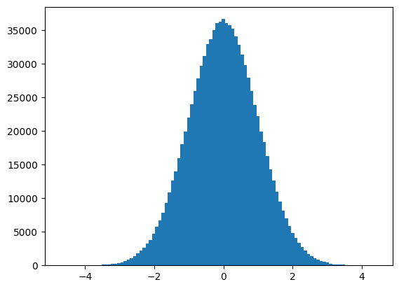

```python
import torch

x = torch.tensor(666)
print(x)
```

    tensor(666)
    


```python
x = torch.tensor([1,2,3,4,5,6])
print(x)
```

    tensor([1, 2, 3, 4, 5, 6])
    


```python
x = torch.ones(2,3)
print(x)
```

    tensor([[1., 1., 1.],
            [1., 1., 1.]])
    


```python
x = torch.ones(2,3,4)
print(x)
```

    tensor([[[1., 1., 1., 1.],
             [1., 1., 1., 1.],
             [1., 1., 1., 1.]],
    
            [[1., 1., 1., 1.],
             [1., 1., 1., 1.],
             [1., 1., 1., 1.]]])
    


```python
x = torch.empty(5,3)
print(x)
```

    tensor([[0.0000e+00, 0.0000e+00, 0.0000e+00],
            [0.0000e+00, 0.0000e+00, 0.0000e+00],
            [0.0000e+00, 0.0000e+00, 1.4013e-45],
            [0.0000e+00, 0.0000e+00, 0.0000e+00],
            [0.0000e+00, 0.0000e+00, 0.0000e+00]])
    


```python
x = torch.rand(5,3)
print(x)
```

    tensor([[0.6766, 0.6989, 0.8963],
            [0.0302, 0.0896, 0.0751],
            [0.9786, 0.4789, 0.7101],
            [0.9586, 0.4929, 0.4813],
            [0.0616, 0.2381, 0.7769]])
    


```python
x = torch.zeros(5,3,dtype=torch.long)
print(x)
```

    tensor([[0, 0, 0],
            [0, 0, 0],
            [0, 0, 0],
            [0, 0, 0],
            [0, 0, 0]])
    


```python
y = x.new_ones(5,3)
print(y)
```

    tensor([[1, 1, 1],
            [1, 1, 1],
            [1, 1, 1],
            [1, 1, 1],
            [1, 1, 1]])
    


```python
z = torch.randn_like(x,dtype=torch.float)
print(z)
```

    tensor([[-1.0515,  0.0923,  0.9110],
            [-0.6102, -0.8279,  0.2911],
            [ 0.1451,  0.3776, -0.0953],
            [-0.7434,  0.0706, -0.0993],
            [-1.6713, -0.1680,  0.1495]])
    


```python
m = torch.tensor([[2,5,3,7],
          [4,2,1,9]])
print(m.size(0),m.size(1),m.size(),sep=' -- ')
```

    2 -- 4 -- torch.Size([2, 4])
    


```python
print(m.numel())
```

    8
    


```python
print(m[0][2])
```

    tensor(3)
    


```python
print(m[:,1])
```

    tensor([5, 2])
    


```python
print(m[0,:])
```

    tensor([2, 5, 3, 7])
    


```python
v = torch.arange(1,5)
print(v)
```

    tensor([1, 2, 3, 4])
    


```python
m[[0],:] @ v
```


    tensor([49])


```python
m + torch.rand(2, 4)
```


    tensor([[2.2771, 5.6838, 3.4746, 7.3979],
            [4.6423, 2.2614, 1.4216, 9.2961]])


```python
print(m.t())

print(m.transpose(0, 1))
```

    tensor([[2, 4],
            [5, 2],
            [3, 1],
            [7, 9]])
    tensor([[2, 4],
            [5, 2],
            [3, 1],
            [7, 9]])
    


```python
torch.linspace(3, 8, 20)
```


    tensor([3.0000, 3.2632, 3.5263, 3.7895, 4.0526, 4.3158, 4.5789, 4.8421, 5.1053,
            5.3684, 5.6316, 5.8947, 6.1579, 6.4211, 6.6842, 6.9474, 7.2105, 7.4737,
            7.7368, 8.0000])


```python
from matplotlib import pyplot as plt
plt.hist(torch.randn(1000).numpy(),100)
```


    (array([ 1.,  0.,  0.,  0.,  0.,  0.,  1.,  2.,  1.,  2.,  3.,  4.,  3.,
             1.,  1.,  1.,  3.,  4.,  3.,  4.,  3.,  5., 10.,  9.,  8., 11.,
            11.,  9., 12., 16., 20., 13., 18., 14., 13., 23., 15., 26., 21.,
            21., 18., 20., 23., 26., 30., 33., 33., 23., 18., 25., 16., 24.,
            20., 26., 26., 30., 30., 13., 21., 17., 20., 18., 15., 12., 12.,
            15., 14., 12.,  8., 11.,  9.,  6.,  4., 11.,  2.,  8.,  8.,  3.,
             1.,  2.,  2.,  4.,  2.,  4.,  2.,  4.,  1.,  1.,  1.,  0.,  1.,
             0.,  0.,  1.,  1.,  0.,  0.,  0.,  0.,  1.]),
     array([-3.18605018e+00, -3.11969924e+00, -3.05334854e+00, -2.98699760e+00,
            -2.92064691e+00, -2.85429597e+00, -2.78794527e+00, -2.72159433e+00,
            -2.65524364e+00, -2.58889270e+00, -2.52254200e+00, -2.45619106e+00,
            -2.38984013e+00, -2.32348943e+00, -2.25713873e+00, -2.19078779e+00,
            -2.12443686e+00, -2.05808616e+00, -1.99173534e+00, -1.92538452e+00,
            -1.85903370e+00, -1.79268289e+00, -1.72633207e+00, -1.65998125e+00,
            -1.59363031e+00, -1.52727950e+00, -1.46092868e+00, -1.39457786e+00,
            -1.32822704e+00, -1.26187623e+00, -1.19552541e+00, -1.12917471e+00,
            -1.06282377e+00, -9.96472836e-01, -9.30122137e-01, -8.63771200e-01,
            -7.97420502e-01, -7.31069565e-01, -6.64718866e-01, -5.98367929e-01,
            -5.32017231e-01, -4.65666294e-01, -3.99315596e-01, -3.32964659e-01,
            -2.66613960e-01, -2.00263023e-01, -1.33912325e-01, -6.75613880e-02,
            -1.21045113e-03,  6.51402473e-02,  1.31491184e-01,  1.97841883e-01,
             2.64192820e-01,  3.30543518e-01,  3.96894455e-01,  4.63245153e-01,
             5.29596090e-01,  5.95946789e-01,  6.62297726e-01,  7.28648424e-01,
             7.94999361e-01,  8.61350298e-01,  9.27700758e-01,  9.94051695e-01,
             1.06040263e+00,  1.12675357e+00,  1.19310451e+00,  1.25945497e+00,
             1.32580590e+00,  1.39215684e+00,  1.45850778e+00,  1.52485824e+00,
             1.59120917e+00,  1.65756011e+00,  1.72391105e+00,  1.79026151e+00,
             1.85661244e+00,  1.92296338e+00,  1.98931432e+00,  2.05566478e+00,
             2.12201571e+00,  2.18836665e+00,  2.25471759e+00,  2.32106853e+00,
             2.38741899e+00,  2.45376992e+00,  2.52012086e+00,  2.58647180e+00,
             2.65282226e+00,  2.71917319e+00,  2.78552413e+00,  2.85187507e+00,
             2.91822553e+00,  2.98457646e+00,  3.05092740e+00,  3.11727834e+00,
             3.18362927e+00,  3.24997973e+00,  3.31633067e+00,  3.38268161e+00,
             3.44903183e+00]),
     <BarContainer object of 100 artists>)


    

    


```python
plt.hist(torch.randn(10**6).numpy(),100)
```


    (array([2.0000e+00, 1.0000e+00, 0.0000e+00, 2.0000e+00, 3.0000e+00,
            2.0000e+00, 1.3000e+01, 1.4000e+01, 1.8000e+01, 2.5000e+01,
            4.0000e+01, 4.2000e+01, 5.9000e+01, 8.9000e+01, 1.1200e+02,
            1.7000e+02, 2.3100e+02, 2.7400e+02, 3.5600e+02, 4.9400e+02,
            6.6100e+02, 8.5700e+02, 1.1100e+03, 1.3650e+03, 1.7510e+03,
            2.2010e+03, 2.6240e+03, 3.2760e+03, 3.7810e+03, 4.7510e+03,
            5.7350e+03, 6.6740e+03, 7.7970e+03, 9.3070e+03, 1.0905e+04,
            1.2625e+04, 1.4032e+04, 1.5951e+04, 1.8054e+04, 1.9966e+04,
            2.2020e+04, 2.3992e+04, 2.6005e+04, 2.7814e+04, 2.9682e+04,
            3.1159e+04, 3.2962e+04, 3.3675e+04, 3.5076e+04, 3.6132e+04,
            3.6284e+04, 3.6686e+04, 3.6078e+04, 3.5755e+04, 3.5232e+04,
            3.4105e+04, 3.2904e+04, 3.1362e+04, 2.9869e+04, 2.7948e+04,
            2.5966e+04, 2.3897e+04, 2.2177e+04, 1.9942e+04, 1.8372e+04,
            1.6332e+04, 1.4275e+04, 1.2603e+04, 1.0977e+04, 9.5400e+03,
            8.1990e+03, 6.9730e+03, 5.8160e+03, 4.8300e+03, 4.0820e+03,
            3.3670e+03, 2.7040e+03, 2.2090e+03, 1.7450e+03, 1.4010e+03,
            1.0390e+03, 8.1600e+02, 6.2400e+02, 5.3700e+02, 4.0700e+02,
            2.8700e+02, 1.8400e+02, 1.4400e+02, 1.1700e+02, 1.1000e+02,
            6.8000e+01, 4.6000e+01, 3.5000e+01, 1.8000e+01, 1.8000e+01,
            8.0000e+00, 5.0000e+00, 9.0000e+00, 6.0000e+00, 5.0000e+00]),
     array([-4.71457434, -4.62314463, -4.53171492, -4.44028473, -4.34885502,
            -4.25742531, -4.1659956 , -4.07456541, -3.9831357 , -3.89170599,
            -3.80027604, -3.70884633, -3.61741638, -3.52598667, -3.43455696,
            -3.34312701, -3.25169706, -3.16026735, -3.06883764, -2.97740769,
            -2.88597775, -2.79454803, -2.70311832, -2.61168838, -2.52025867,
            -2.42882872, -2.33739901, -2.24596906, -2.15453935, -2.0631094 ,
            -1.97167969, -1.88024974, -1.78882003, -1.69739032, -1.60596037,
            -1.51453066, -1.42310071, -1.331671  , -1.24024105, -1.14881134,
            -1.05738139, -0.96595168, -0.87452173, -0.78309202, -0.69166231,
            -0.60023212, -0.50880241, -0.4173727 , -0.32594299, -0.23451328,
            -0.1430831 , -0.05165339,  0.03977633,  0.13120604,  0.22263622,
             0.31406593,  0.40549564,  0.49692535,  0.58835554,  0.67978525,
             0.77121496,  0.86264467,  0.95407486,  1.04550457,  1.13693428,
             1.22836399,  1.3197937 ,  1.41122389,  1.5026536 ,  1.59408331,
             1.68551302,  1.77694321,  1.86837292,  1.95980263,  2.05123234,
             2.14266253,  2.23409224,  2.32552195,  2.41695166,  2.50838184,
             2.59981155,  2.69124126,  2.78267097,  2.87410069,  2.96553087,
             3.05696058,  3.14839029,  3.23982   ,  3.33124971,  3.42267942,
             3.51411009,  3.6055398 ,  3.69696951,  3.78839922,  3.87982893,
             3.97125864,  4.06268835,  4.15411806,  4.24554777,  4.33697844,
             4.42840767]),
     <BarContainer object of 100 artists>)


    

    


```python
a=torch.tensor([[1,2,3,4]])
b=torch.tensor([[5,6,7,8]])
print(torch.cat((a,b),0))
```

    tensor([[1, 2, 3, 4],
            [5, 6, 7, 8]])
    


```python
print( torch.cat((a,b),1))
```

    tensor([[1, 2, 3, 4, 5, 6, 7, 8]])
    
