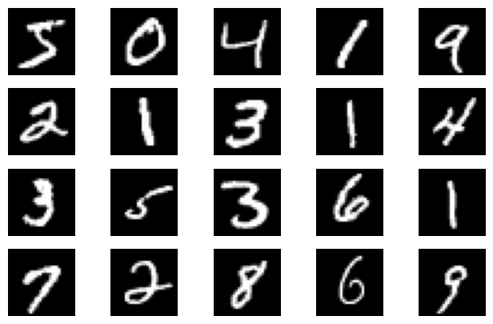
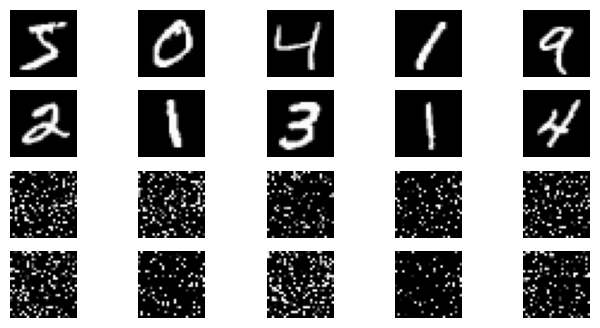
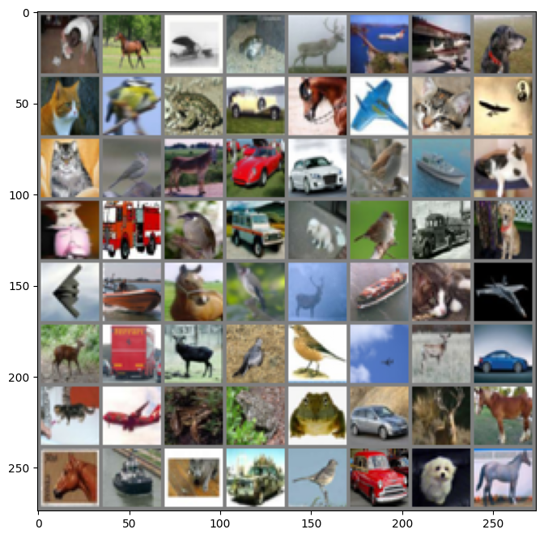

<center>姓名：张心顺  学号：23120014029</center>

| 姓名和学号？         | 张心顺，23120014029                                          |
| -------------------- | ------------------------------------------------------------ |
| 本实验属于哪门课程？ | 中国海洋大学25秋《软件工程原理与实践》                       |
| 实验名称？           | 实验3：卷积神经网络                                          |
| 发布地址？           | [LoongGold/2025FALLSEPP](https://github.com/LoongGold/2025FALLSEPP) |

## 一、实验内容

#### 【第⼀部分：代码练习】在⾕歌 Colab 上完成 pytorch 代码练习，关键步骤截图，并附⼀些自己的想法和解读。

##### 实验3：MNIST数据集分类

构建简单的CNN对 mnist 数据集进⾏分类。同时，学习池化与卷积操作的基本作⽤。

```python
import torch
import torch.nn as nn
import torch.nn.functional as F
import torch.optim as optim
from torchvision import datasets, transforms
import matplotlib.pyplot as plt
import numpy

def get_n_params(model):
  np=0
  for p in list(model.parameters()):
    np += p.nelement()
  return np

device = torch.device("cuda:0" if torch.cuda.is_available() else "cpu")
```


```python
input_size  = 28*28
output_size = 10

train_loader = torch.utils.data.DataLoader(
    datasets.MNIST('./data', train=True, download=True,
        transform=transforms.Compose(
            [transforms.ToTensor(),
             transforms.Normalize((0.1307,), (0.3081,))])),
    batch_size=64, shuffle=True)

test_loader = torch.utils.data.DataLoader(
    datasets.MNIST('./data', train=False, transform=transforms.Compose([
             transforms.ToTensor(),
             transforms.Normalize((0.1307,), (0.3081,))])),
    batch_size=1000, shuffle=True)
```

    100%|██████████| 9.91M/9.91M [00:01<00:00, 4.98MB/s]
    100%|██████████| 28.9k/28.9k [00:00<00:00, 126kB/s]
    100%|██████████| 1.65M/1.65M [00:01<00:00, 1.24MB/s]
    100%|██████████| 4.54k/4.54k [00:00<00:00, 9.54MB/s]


```python
plt.figure(figsize=(8, 5))
for i in range(20):
    plt.subplot(4, 5, i + 1)
    image, _ = train_loader.dataset.__getitem__(i)
    plt.imshow(image.squeeze().numpy(),'gray')
    plt.axis('off');
```


​    

​    


```python
class FC2Layer(nn.Module):
  def __init__(self, input_size, n_hidden, output_size):

      super(FC2Layer, self).__init__()
      self.input_size = input_size
      self.network = nn.Sequential(
        nn.Linear(input_size, n_hidden),
        nn.ReLU(),
        nn.Linear(n_hidden, n_hidden),
        nn.ReLU(),
        nn.Linear(n_hidden, output_size),
        nn.LogSoftmax(dim=1)
      )

  def forward(self, x):

    x = x.view(-1, self.input_size)
    return self.network(x)

class CNN(nn.Module):
  def __init__(self, input_size, n_feature, output_size):

      super(CNN, self).__init__()

      self.n_feature = n_feature
      self.conv1 = nn.Conv2d(in_channels=1, out_channels=n_feature, kernel_size=5)
      self.conv2 = nn.Conv2d(n_feature, n_feature, kernel_size=5)
      self.fc1 = nn.Linear(n_feature*4*4, 50)
      self.fc2 = nn.Linear(50, 10)

  def forward(self, x, verbose=False):
      x = self.conv1(x)
      x = F.relu(x)
      x = F.max_pool2d(x, kernel_size=2)
      x = self.conv2(x)
      x = F.relu(x)
      x = F.max_pool2d(x, kernel_size=2)
      x = x.view(-1, self.n_feature*4*4)
      x = self.fc1(x)
      x = F.relu(x)
      x = self.fc2(x)
      x = F.log_softmax(x, dim=1)

      return x
```


```python
def train(model):
  model.train()

  for batch_idx, (data, target) in enumerate(train_loader):

    data, target = data.to(device), target.to(device)
    optimizer.zero_grad()
    output = model(data)
    loss = F.nll_loss(output, target)
    loss.backward()
    optimizer.step()
    if batch_idx % 100 == 0:
      print('Train: [{}/{} ({:.0f}%)]\tLoss: {:.6f}'.format(
        batch_idx * len(data), len(train_loader.dataset),
        100. * batch_idx / len(train_loader), loss.item()))

def test(model):
    model.eval()
    test_loss = 0
    correct = 0
    for data, target in test_loader:

        data, target = data.to(device), target.to(device)

        output = model(data)

        test_loss += F.nll_loss(output, target, reduction='sum').item()

        pred = output.data.max(1, keepdim=True)[1]

        correct += pred.eq(target.data.view_as(pred)).cpu().sum().item()
    test_loss /= len(test_loader.dataset)
    accuracy = 100. * correct / len(test_loader.dataset)
    print('\nTest set: Average loss: {:.4f}, Accuracy: {}/{} ({:.0f}%)\n'.format(
        test_loss, correct, len(test_loader.dataset),accuracy))
```


```python
n_hidden = 8
model_fnn = FC2Layer(input_size, n_hidden, output_size)
model_fnn.to(device)
optimizer = optim.SGD(model_fnn.parameters(), lr=0.01, momentum=0.5)
print('Number of parameters: {}'.format(get_n_params(model_fnn)))

train(model_fnn)
test(model_fnn)
```

    Number of parameters: 6442
    Train: [0/60000 (0%)]	Loss: 2.360977
    Train: [6400/60000 (11%)]	Loss: 1.962216
    Train: [12800/60000 (21%)]	Loss: 1.409456
    Train: [19200/60000 (32%)]	Loss: 1.063736
    Train: [25600/60000 (43%)]	Loss: 0.555882
    Train: [32000/60000 (53%)]	Loss: 0.515634
    Train: [38400/60000 (64%)]	Loss: 0.547306
    Train: [44800/60000 (75%)]	Loss: 0.487921
    Train: [51200/60000 (85%)]	Loss: 0.551026
    Train: [57600/60000 (96%)]	Loss: 0.676240
    
    Test set: Average loss: 0.4444, Accuracy: 8711/10000 (87%)


​    


```python
n_features = 6
model_cnn = CNN(input_size, n_features, output_size)
model_cnn.to(device)
optimizer = optim.SGD(model_cnn.parameters(), lr=0.01, momentum=0.5)
print('Number of parameters: {}'.format(get_n_params(model_cnn)))

train(model_cnn)
test(model_cnn)
```

    Number of parameters: 6422
    Train: [0/60000 (0%)]	Loss: 2.339114
    Train: [6400/60000 (11%)]	Loss: 2.188580
    Train: [12800/60000 (21%)]	Loss: 0.473328
    Train: [19200/60000 (32%)]	Loss: 0.604167
    Train: [25600/60000 (43%)]	Loss: 0.202750
    Train: [32000/60000 (53%)]	Loss: 0.565423
    Train: [38400/60000 (64%)]	Loss: 0.278614
    Train: [44800/60000 (75%)]	Loss: 0.201671
    Train: [51200/60000 (85%)]	Loss: 0.168406
    Train: [57600/60000 (96%)]	Loss: 0.301435
    
    Test set: Average loss: 0.2067, Accuracy: 9393/10000 (94%)


​    


```python
perm = torch.randperm(784)
plt.figure(figsize=(8, 4))
for i in range(10):
    image, _ = train_loader.dataset.__getitem__(i)

    image_perm = image.view(-1, 28*28).clone()
    image_perm = image_perm[:, perm]
    image_perm = image_perm.view(-1, 1, 28, 28)
    plt.subplot(4, 5, i + 1)
    plt.imshow(image.squeeze().numpy(), 'gray')
    plt.axis('off')
    plt.subplot(4, 5, i + 11)
    plt.imshow(image_perm.squeeze().numpy(), 'gray')
    plt.axis('off')
```


​    

​    


```python
def perm_pixel(data, perm):

    data_new = data.view(-1, 28*28)

    data_new = data_new[:, perm]

    data_new = data_new.view(-1, 1, 28, 28)
    return data_new

def train_perm(model, perm):
    model.train()
    for batch_idx, (data, target) in enumerate(train_loader):
        data, target = data.to(device), target.to(device)

        data = perm_pixel(data, perm)

        optimizer.zero_grad()
        output = model(data)
        loss = F.nll_loss(output, target)
        loss.backward()
        optimizer.step()
        if batch_idx % 100 == 0:
            print('Train: [{}/{} ({:.0f}%)]\tLoss: {:.6f}'.format(
                batch_idx * len(data), len(train_loader.dataset),
                100. * batch_idx / len(train_loader), loss.item()))

def test_perm(model, perm):
    model.eval()
    test_loss = 0
    correct = 0
    for data, target in test_loader:
        data, target = data.to(device), target.to(device)

        data = perm_pixel(data, perm)

        output = model(data)
        test_loss += F.nll_loss(output, target, reduction='sum').item()
        pred = output.data.max(1, keepdim=True)[1]
        correct += pred.eq(target.data.view_as(pred)).cpu().sum().item()

    test_loss /= len(test_loader.dataset)
    accuracy = 100. * correct / len(test_loader.dataset)
    print('\nTest set: Average loss: {:.4f}, Accuracy: {}/{} ({:.0f}%)\n'.format(
        test_loss, correct, len(test_loader.dataset),
        accuracy))
```


```python
perm = torch.randperm(784)
n_hidden = 8
model_fnn.to(device)
optimizer = optim.SGD(model_fnn.parameters(), lr=0.01, momentum=0.5)
print('Number of parameters: {}'.format(get_n_params(model_fnn)))

train_perm(model_fnn, perm)
test_perm(model_fnn, perm)
```

    Number of parameters: 6442
    Train: [0/60000 (0%)]	Loss: 2.449645
    Train: [6400/60000 (11%)]	Loss: 0.534315
    Train: [12800/60000 (21%)]	Loss: 0.410337
    Train: [19200/60000 (32%)]	Loss: 0.449859
    Train: [25600/60000 (43%)]	Loss: 0.427823
    Train: [32000/60000 (53%)]	Loss: 0.409551
    Train: [38400/60000 (64%)]	Loss: 0.249561
    Train: [44800/60000 (75%)]	Loss: 0.323311
    Train: [51200/60000 (85%)]	Loss: 0.267980
    Train: [57600/60000 (96%)]	Loss: 0.336914
    
    Test set: Average loss: 0.3889, Accuracy: 8886/10000 (89%)


​    


```python
perm = torch.randperm(784)

n_features = 6
model_cnn = CNN(input_size, n_features, output_size)
model_cnn.to(device)
optimizer = optim.SGD(model_cnn.parameters(), lr=0.01, momentum=0.5)
print('Number of parameters: {}'.format(get_n_params(model_cnn)))

train_perm(model_cnn, perm)
test_perm(model_cnn, perm)
```

    Number of parameters: 6422
    Train: [0/60000 (0%)]	Loss: 2.320812
    Train: [6400/60000 (11%)]	Loss: 2.280069
    Train: [12800/60000 (21%)]	Loss: 2.178331
    Train: [19200/60000 (32%)]	Loss: 1.861734
    Train: [25600/60000 (43%)]	Loss: 1.614097
    Train: [32000/60000 (53%)]	Loss: 1.060736
    Train: [38400/60000 (64%)]	Loss: 0.810454
    Train: [44800/60000 (75%)]	Loss: 0.809534
    Train: [51200/60000 (85%)]	Loss: 0.727617
    Train: [57600/60000 (96%)]	Loss: 0.689340
    
    Test set: Average loss: 0.6176, Accuracy: 7976/10000 (80%)    


---

##### 实验4：CIFAR10 数据集分类

使⽤ CNN 对 CIFAR10 数据集进⾏分类。

```python
import torch
import torchvision
import torchvision.transforms as transforms
import matplotlib.pyplot as plt
import numpy as np
import torch.nn as nn
import torch.nn.functional as F
import torch.optim as optim

device = torch.device("cuda:0" if torch.cuda.is_available() else "cpu")

transform = transforms.Compose(
    [transforms.ToTensor(),
     transforms.Normalize((0.5, 0.5, 0.5), (0.5, 0.5, 0.5))])

trainset = torchvision.datasets.CIFAR10(root='./data', train=True,
                     download=True, transform=transform)
trainloader = torch.utils.data.DataLoader(trainset, batch_size=64,
                      shuffle=True, num_workers=2)
testset = torchvision.datasets.CIFAR10(root='./data', train=False,
                    download=True, transform=transform)
testloader = torch.utils.data.DataLoader(testset, batch_size=8,
                     shuffle=False, num_workers=2)

classes = ('plane', 'car', 'bird', 'cat',
           'deer', 'dog', 'frog', 'horse', 'ship', 'truck')
```


```python
def imshow(img):
    plt.figure(figsize=(8,8))

    img = img / 2 + 0.5
    npimg = img.numpy()
    plt.imshow(np.transpose(npimg, (1, 2, 0)))
    plt.show()

# 这样运行会报错：images, labels = iter(testloader).next()
dataiter = iter(trainloader)
images, labels = next(dataiter)

imshow(torchvision.utils.make_grid(images))

for j in range(8):
    print(classes[labels[j]])
```


​    

​    


    cat
    bird
    horse
    deer
    frog
    horse
    horse
    plane


```python
class Net(nn.Module):
  def __init__(self):
        super(Net, self).__init__()
        self.conv1 = nn.Conv2d(3, 6, 5)
        self.pool = nn.MaxPool2d(2, 2)
        self.conv2 = nn.Conv2d(6, 16, 5)
        self.fc1 = nn.Linear(16 * 5 * 5, 120)
        self.fc2 = nn.Linear(120, 84)
        self.fc3 = nn.Linear(84, 10)

  def forward(self, x):
        x = self.pool(F.relu(self.conv1(x)))
        x = self.pool(F.relu(self.conv2(x)))
        x = x.view(-1, 16 * 5 * 5)
        x = F.relu(self.fc1(x))
        x = F.relu(self.fc2(x))
        x = self.fc3(x)
        return x

net = Net().to(device)
criterion = nn.CrossEntropyLoss()
optimizer = optim.Adam(net.parameters(), lr=0.001)
```


```python
for epoch in range(10):

    for i, (inputs, labels) in enumerate(trainloader):
        inputs = inputs.to(device)
        labels = labels.to(device)

        optimizer.zero_grad()

        outputs = net(inputs)
        loss = criterion(outputs, labels)
        loss.backward()
        optimizer.step()

        if i % 100 == 0:
            print('Epoch: %d Minibatch: %5d loss: %.3f' %(epoch + 1, i + 1, loss.item()))
print('Finished Training')
```

    Epoch: 1 Minibatch:     1 loss: 2.304
    Epoch: 1 Minibatch:   101 loss: 1.669
    Epoch: 1 Minibatch:   201 loss: 1.571
    Epoch: 1 Minibatch:   301 loss: 1.661
    Epoch: 1 Minibatch:   401 loss: 1.689
    Epoch: 1 Minibatch:   501 loss: 1.544
    Epoch: 1 Minibatch:   601 loss: 1.510
    Epoch: 1 Minibatch:   701 loss: 1.726
    Epoch: 2 Minibatch:     1 loss: 1.385
    Epoch: 2 Minibatch:   101 loss: 1.353
    Epoch: 2 Minibatch:   201 loss: 1.241
    Epoch: 2 Minibatch:   301 loss: 1.370
    Epoch: 2 Minibatch:   401 loss: 1.361
    Epoch: 2 Minibatch:   501 loss: 1.423
    Epoch: 2 Minibatch:   601 loss: 1.285
    Epoch: 2 Minibatch:   701 loss: 1.246
    Epoch: 3 Minibatch:     1 loss: 1.235
    Epoch: 3 Minibatch:   101 loss: 1.401
    Epoch: 3 Minibatch:   201 loss: 1.229
    Epoch: 3 Minibatch:   301 loss: 1.108
    Epoch: 3 Minibatch:   401 loss: 0.996
    Epoch: 3 Minibatch:   501 loss: 1.227
    Epoch: 3 Minibatch:   601 loss: 1.192
    Epoch: 3 Minibatch:   701 loss: 0.992
    Epoch: 4 Minibatch:     1 loss: 0.956
    Epoch: 4 Minibatch:   101 loss: 1.055
    Epoch: 4 Minibatch:   201 loss: 1.179
    Epoch: 4 Minibatch:   301 loss: 1.128
    Epoch: 4 Minibatch:   401 loss: 1.280
    Epoch: 4 Minibatch:   501 loss: 1.316
    Epoch: 4 Minibatch:   601 loss: 1.169
    Epoch: 4 Minibatch:   701 loss: 1.163
    Epoch: 5 Minibatch:     1 loss: 1.133
    Epoch: 5 Minibatch:   101 loss: 1.085
    Epoch: 5 Minibatch:   201 loss: 1.415
    Epoch: 5 Minibatch:   301 loss: 1.183
    Epoch: 5 Minibatch:   401 loss: 0.899
    Epoch: 5 Minibatch:   501 loss: 1.201
    Epoch: 5 Minibatch:   601 loss: 1.076
    Epoch: 5 Minibatch:   701 loss: 0.883
    Epoch: 6 Minibatch:     1 loss: 1.004
    Epoch: 6 Minibatch:   101 loss: 0.956
    Epoch: 6 Minibatch:   201 loss: 0.960
    Epoch: 6 Minibatch:   301 loss: 1.056
    Epoch: 6 Minibatch:   401 loss: 0.858
    Epoch: 6 Minibatch:   501 loss: 0.974
    Epoch: 6 Minibatch:   601 loss: 1.107
    Epoch: 6 Minibatch:   701 loss: 1.226
    Epoch: 7 Minibatch:     1 loss: 1.061
    Epoch: 7 Minibatch:   101 loss: 1.373
    Epoch: 7 Minibatch:   201 loss: 1.012
    Epoch: 7 Minibatch:   301 loss: 0.913
    Epoch: 7 Minibatch:   401 loss: 1.123
    Epoch: 7 Minibatch:   501 loss: 0.864
    Epoch: 7 Minibatch:   601 loss: 0.987
    Epoch: 7 Minibatch:   701 loss: 0.970
    Epoch: 8 Minibatch:     1 loss: 0.912
    Epoch: 8 Minibatch:   101 loss: 0.879
    Epoch: 8 Minibatch:   201 loss: 0.617
    Epoch: 8 Minibatch:   301 loss: 0.823
    Epoch: 8 Minibatch:   401 loss: 0.869
    Epoch: 8 Minibatch:   501 loss: 1.094
    Epoch: 8 Minibatch:   601 loss: 0.955
    Epoch: 8 Minibatch:   701 loss: 1.002
    Epoch: 9 Minibatch:     1 loss: 0.790
    Epoch: 9 Minibatch:   101 loss: 0.777
    Epoch: 9 Minibatch:   201 loss: 1.081
    Epoch: 9 Minibatch:   301 loss: 0.847
    Epoch: 9 Minibatch:   401 loss: 1.341
    Epoch: 9 Minibatch:   501 loss: 0.939
    Epoch: 9 Minibatch:   601 loss: 0.939
    Epoch: 9 Minibatch:   701 loss: 1.037
    Epoch: 10 Minibatch:     1 loss: 1.242
    Epoch: 10 Minibatch:   101 loss: 0.803
    Epoch: 10 Minibatch:   201 loss: 0.830
    Epoch: 10 Minibatch:   301 loss: 0.750
    Epoch: 10 Minibatch:   401 loss: 0.962
    Epoch: 10 Minibatch:   501 loss: 0.828
    Epoch: 10 Minibatch:   601 loss: 0.757
    Epoch: 10 Minibatch:   701 loss: 0.860
    Finished Training


```python
# 这样运行会报错：images, labels = iter(testloader).next()
dataiter = iter(trainloader)
images, labels = next(dataiter)

imshow(torchvision.utils.make_grid(images))

for j in range(8):
    print(classes[labels[j]])
```


​    

​    


    dog
    horse
    plane
    frog
    deer
    plane
    plane
    dog


```python
outputs = net(images.to(device))
_, predicted = torch.max(outputs, 1)

for j in range(8):
    print(classes[predicted[j]])
```

    dog
    deer
    plane
    cat
    deer
    plane
    truck
    bird


```python
correct = 0
total = 0

for data in testloader:
    images, labels = data
    images, labels = images.to(device), labels.to(device)
    outputs = net(images)
    _, predicted = torch.max(outputs.data, 1)
    total += labels.size(0)
    correct += (predicted == labels).sum().item()

print('Accuracy of the network on the 10000 test images: %d %%' % (100 * correct / total))
```

    Accuracy of the network on the 10000 test images: 63 %


---

##### 实验5：VGG16对CIFAR10分类

使⽤ VGG16 对 CIFAR10 分类。

```python
import torch
import torchvision
import torchvision.transforms as transforms
import matplotlib.pyplot as plt
import numpy as np
import torch.nn as nn
import torch.nn.functional as F
import torch.optim as optim

device = torch.device("cuda:0" if torch.cuda.is_available() else "cpu")

transform_train = transforms.Compose([
    transforms.RandomCrop(32, padding=4),
    transforms.RandomHorizontalFlip(),
    transforms.ToTensor(),
    transforms.Normalize((0.4914, 0.4822, 0.4465), (0.2023, 0.1994, 0.2010))])

transform_test = transforms.Compose([
    transforms.ToTensor(),
    transforms.Normalize((0.4914, 0.4822, 0.4465), (0.2023, 0.1994, 0.2010))])

trainset = torchvision.datasets.CIFAR10(root='./data', train=True,  download=True, transform=transform_train)
testset  = torchvision.datasets.CIFAR10(root='./data', train=False, download=True, transform=transform_test)

trainloader = torch.utils.data.DataLoader(trainset, batch_size=128, shuffle=True, num_workers=2)
testloader = torch.utils.data.DataLoader(testset, batch_size=128, shuffle=False, num_workers=2)

classes = ('plane', 'car', 'bird', 'cat',
           'deer', 'dog', 'frog', 'horse', 'ship', 'truck')
```

    100%|██████████| 170M/170M [00:03<00:00, 43.9MB/s]


```python
class VGG(nn.Module):
    def __init__(self):
        super(VGG, self).__init__()
        self.cfg = [64, 'M', 128, 'M', 256, 256, 'M', 512, 512, 'M', 512, 512, 'M']
        self.features = self._make_layers(self.cfg)# cfg不对，应当修改成self.cfg
        self.classifier = nn.Linear(512, 10)# 2048不太合适。

    def forward(self, x):
        out = self.features(x)
        out = out.view(out.size(0), -1)
        out = self.classifier(out)
        return out

    def _make_layers(self, cfg):
        layers = []
        in_channels = 3
        for x in cfg:
            if x == 'M':
                layers += [nn.MaxPool2d(kernel_size=2, stride=2)]
            else:
                layers += [nn.Conv2d(in_channels, x, kernel_size=3, padding=1),
                           nn.BatchNorm2d(x),
                           nn.ReLU(inplace=True)]
                in_channels = x
        layers += [nn.AvgPool2d(kernel_size=1, stride=1)]
        return nn.Sequential(*layers)
```


```python
net = VGG().to(device)
criterion = nn.CrossEntropyLoss()
optimizer = optim.Adam(net.parameters(), lr=0.001)
```


```python
for epoch in range(10):
    for i, (inputs, labels) in enumerate(trainloader):
        inputs = inputs.to(device)
        labels = labels.to(device)

        optimizer.zero_grad()

        outputs = net(inputs)
        loss = criterion(outputs, labels)
        loss.backward()
        optimizer.step()

        if i % 100 == 0:
            print('Epoch: %d Minibatch: %5d loss: %.3f' %(epoch + 1, i + 1, loss.item()))

print('Finished Training')
```

    Epoch: 1 Minibatch:     1 loss: 2.330
    Epoch: 1 Minibatch:   101 loss: 1.408
    Epoch: 1 Minibatch:   201 loss: 1.162
    Epoch: 1 Minibatch:   301 loss: 1.148
    Epoch: 2 Minibatch:     1 loss: 0.932
    Epoch: 2 Minibatch:   101 loss: 1.208
    Epoch: 2 Minibatch:   201 loss: 0.868
    Epoch: 2 Minibatch:   301 loss: 0.766
    Epoch: 3 Minibatch:     1 loss: 0.788
    Epoch: 3 Minibatch:   101 loss: 0.890
    Epoch: 3 Minibatch:   201 loss: 0.775
    Epoch: 3 Minibatch:   301 loss: 0.723
    Epoch: 4 Minibatch:     1 loss: 0.731
    Epoch: 4 Minibatch:   101 loss: 0.728
    Epoch: 4 Minibatch:   201 loss: 0.824
    Epoch: 4 Minibatch:   301 loss: 0.510
    Epoch: 5 Minibatch:     1 loss: 0.633
    Epoch: 5 Minibatch:   101 loss: 0.575
    Epoch: 5 Minibatch:   201 loss: 0.593
    Epoch: 5 Minibatch:   301 loss: 0.523
    Epoch: 6 Minibatch:     1 loss: 0.578
    Epoch: 6 Minibatch:   101 loss: 0.556
    Epoch: 6 Minibatch:   201 loss: 0.530
    Epoch: 6 Minibatch:   301 loss: 0.316
    Epoch: 7 Minibatch:     1 loss: 0.594
    Epoch: 7 Minibatch:   101 loss: 0.453
    Epoch: 7 Minibatch:   201 loss: 0.552
    Epoch: 7 Minibatch:   301 loss: 0.530
    Epoch: 8 Minibatch:     1 loss: 0.438
    Epoch: 8 Minibatch:   101 loss: 0.413
    Epoch: 8 Minibatch:   201 loss: 0.395
    Epoch: 8 Minibatch:   301 loss: 0.717
    Epoch: 9 Minibatch:     1 loss: 0.548
    Epoch: 9 Minibatch:   101 loss: 0.362
    Epoch: 9 Minibatch:   201 loss: 0.480
    Epoch: 9 Minibatch:   301 loss: 0.407
    Epoch: 10 Minibatch:     1 loss: 0.331
    Epoch: 10 Minibatch:   101 loss: 0.400
    Epoch: 10 Minibatch:   201 loss: 0.544
    Epoch: 10 Minibatch:   301 loss: 0.346
    Finished Training


```python
correct = 0
total = 0

for data in testloader:
    images, labels = data
    images, labels = images.to(device), labels.to(device)
    outputs = net(images)
    _, predicted = torch.max(outputs.data, 1)
    total += labels.size(0)
    correct += (predicted == labels).sum().item()

print('Accuracy of the network on the 10000 test images: %.2f %%' % (
    100 * correct / total))
```

    Accuracy of the network on the 10000 test images: 84.50 %


**感想主要在一些小注释中，不知道为什么代码敲完没法运行，研究后修改了几个小部分，至少有结果了。**

---


## 二、问题总结与体会

描述实验过程中所遇到的问题，以及是如何解决的。

- **dataloader ⾥⾯ shuffle 取不同值有什么区别？**

  shuffle=True时，在每个 epoch 开始前，都会对数据进行一次随机排序。模型得到的每个 batch 都随机组合，有助于模型泛化，避免局部最优。

  shuffle=False时，数据将始终以固定的顺序被加载。在评估模型性能时，得到一致的、可复现的标准。

  

- **transform ⾥，取了不同值，这个有什么区别？**

  transform 用于对输入的图像数据进行预处理。

  实验3: Normalize((0.1307,), (0.3081,))

  得到 MNIST 训练集上计算出的单通道均值和标准差。

  实验4: Normalize((0.5, 0.5, 0.5), (0.5, 0.5, 0.5))

  通用的标准化值。

  实验5: Normalize((0.4914, 0.4822, 0.4465), (0.2023, 0.1994, 0.2010))

  在CIFAR10训练集上分三通道计算的均值和标准差。

  

- **epoch 和 batch 的区别？**

  Batch: 整个数据集分成的小块。

  Epoch: 模型完整地计算一轮次所有训练数据。

  

- **1x1的卷积和 FC 有什么区别？主要起什么作⽤？**

  FC：操作对象是一维向量。

  1x1 卷积：操作对象是三维特征图（[C, H, W]）。

  FC：没有参数共享。

  1x1 卷积：在空间上共享参数。

  主要作用（1x1 卷积）：

  降维或升维：在不改变 H/W 的情况下，减少通道数，降低后续层的计算量和参数量。反之，也可以增加通道数。

  跨通道信息融合 (Network-in-Network)：

  1x1 卷积可以看作是对每个像素的 C 个通道值进行一次线性组合和非线性激活。它允许网络学习通道之间更复杂的交互关系，增强了网络的非线性表达能力。

  

- **residual leanring 为什么能够提升准确率？**

  残差学习通过以下两个方式提升准确率：

  解决退化：让模型将权重 F(x)优化到 0 ，比通过多层非线性变换拟合一个 H(x) = x要容易。

  缓解梯度消失：H(x) = F(x) + x的加法操作在反向传播时，梯度会无衰减地传递到 x，使其能够更深地传播回浅层网络。

  

- **代码练习⼆⾥，⽹络和1989年 Lecun 提出的 LeNet 有什么区别？**

  输入通道：LeNet-5 为单通道设计。实验4 的网络 nn.Conv2d(3, 6, 5) 为3通道设计。

  激活函数：LeNet-5 使用的是 Sigmoid 或 tanh 激活函数。实验4 使用的是 ReLU (F.relu)。

  池化层：LeNet-5 的池化层（Subsampling）是“平均池化”并且带有可学习的参数。实验4 使用的是现代标准的 MaxPool2d（最大池化）。

  网络末端：LeNet-5 在第二个池化层后还有一个卷积层（C5），然后才是全连接层。实验4 的网络在第二个池化层后直接展平（x.view(...)）并连接全连接层。

  

- **代码练习⼆⾥，卷积以后feature map 尺⼨会变⼩，如何应⽤ Residual Learning?**

  在应用残差学习 H(x) = F(x) + x 时，必须保证 F(x) 和 x 的维度完全相同才能相加。当维度变化时，必须对 x（跳跃连接）进行变换。当维度变化时，使用1x1卷积来变换x的维度，使其与F(x)相匹配。

  

- **有什么⽅法可以进⼀步提升准确率？**

  1. 调整epoch，在模型尚未收敛的情况下，适当增大epoch。
  2. 调整学习率，使用学习率衰减。
  3. 使用更强的模型架构，比如ResNet。